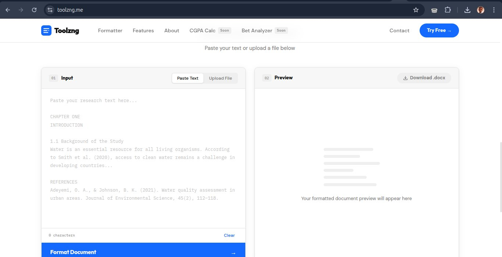

<div align="center">


# Toolzng

**Academic research formatter built for Nigerian students.**

[](https://toolzng.me)
[](https://go.dev)
[](https://python.org)
[](./LICENSE)

[**→ Try it live at toolzng.me**](https://toolzng.me)

</div>

---

## Overview

Toolzng takes raw research text or uploaded `.docx` files and automatically formats them to **APA 7th edition standard** — the format required by most Nigerian universities. It verifies every reference against a live academic database and correctly identifies scientific names.

> Built at Yaba College of Technology, Lagos — by a student who was tired of spending hours formatting research documents manually.

---

## Screenshots

### Homepage


### Formatter Tool


---

## Features

| | Feature | Detail |
|-|---------|--------|
| 📝 | **APA 7th Edition** | Bold headings, first-line paragraph indents, hanging reference indents |
| 🔗 | **DOI Verification** | Each reference verified against 140M+ papers via Crossref API |
| 🔬 | **Scientific Names** | Italicises confirmed species using local DB (70+ entries) + GBIF API |
| 📄 | **.docx Download** | Ready-to-submit Word document: Times New Roman 12pt, double spacing |
| 👁️ | **Live Preview** | See the formatted output instantly before downloading |
| ⬆️ | **File Upload** | Accepts `.docx` and `.txt` uploads, not just pasted text |
| 🔒 | **Rate Limited** | Max 10 requests/IP/minute — prevents abuse |
| 🧹 | **Auto Cleanup** | Generated files automatically deleted after 30 minutes |

---

## Architecture

```
┌─────────────────────────────────────────────────────────────┐
│                        FRONTEND                              │
│         HTML + CSS + Vanilla JS (no frameworks)             │
│                                                             │
│  ┌──────────────┐              ┌──────────────────────────┐ │
│  │  Input Panel │              │     Preview Panel        │ │
│  │  Paste/Upload│   POST /format│  HTML Preview + DOI     │ │
│  └──────┬───────┘  ──────────► │  badges + Download btn  │ │
│         │                      └──────────────────────────┘ │
└─────────┼───────────────────────────────────────────────────┘
          │
          ▼
┌─────────────────────────────────────────────────────────────┐
│                    GO BACKEND (net/http)                     │
│                                                             │
│  ┌─────────────┐    ┌──────────────┐    ┌───────────────┐  │
│  │  Middleware  │    │   Handlers   │    │  Formatter    │  │
│  │             │    │              │    │               │  │
│  │ RateLimit   │───►│ FormatHandler│───►│ parser.go     │  │
│  │ CORS        │    │              │    │ rules.go      │  │
│  │ SecHeaders  │    │ DownloadHndlr│    │ doi.go        │  │
│  │ TmpCleanup  │    │              │    │ species.go    │  │
│  └─────────────┘    └──────────────┘    └──────┬────────┘  │
└──────────────────────────────────────────────── │ ──────────┘
                                                  │
                    ┌─────────────────────────────┤
                    │                             │
                    ▼                             ▼
        ┌───────────────────┐       ┌─────────────────────┐
        │   External APIs   │       │  Python Subprocess  │
        │                   │       │                     │
        │  Crossref API     │       │   docx_gen.py       │
        │  (DOI lookup)     │       │   (python-docx)     │
        │                   │       │                     │
        │  GBIF API         │       │  Generates .docx    │
        │  (Species check)  │       │  with APA rules     │
        └───────────────────┘       └─────────────────────┘
```

---

## Tech Stack

```
Language (Backend)   Go 1.21        — net/http, no framework, zero external deps
Language (Docx)      Python 3       — python-docx for Word document generation  
Language (Frontend)  Vanilla JS     — fetch API, no React, no bundlers
DOI Verification     Crossref API   — 140M+ academic papers, free polite pool
Species Check        GBIF API       — 9M+ biological species, no key required
Contact Form         Web3Forms      — serverless email delivery
Analytics            Plausible.io   — privacy-friendly, no cookies
Containerisation     Docker         — single Dockerfile, Go + Python in one image
Hosting              Railway        — auto-deploy from GitHub push
Domain               Namecheap      — toolzng.me (via GitHub Student Developer Pack)
```

---

## How a Format Request Works

```
1. User pastes text or uploads .docx
         ↓
2. Middleware: rate limit check (10 req/IP/min) + security headers
         ↓
3. Input validation: file type, size limits (500KB text / 5MB file)
         ↓
4. parser.go: splits text into typed Blocks
   ├── "heading"   → CHAPTER, 1.1 Title, ALL CAPS lines
   ├── "reference" → Author, Year. pattern (APA format)
   └── "paragraph" → everything else
         ↓
5. doi.go: Crossref API lookup for each reference block
   └── Score > 50 → Verified ✓  |  Score < 50 → Possible ~  |  None → ✗
         ↓
6. species.go: scientific name detection
   ├── Local database check (70+ species, instant)
   └── GBIF API fallback for unknowns (concurrent goroutines)
         ↓
7. rules.go: generates HTML preview
   ├── Wraps et al. in <em> tags
   ├── Wraps confirmed species in <em> tags  
   ├── Replaces & with "and" in references
   └── Italicises journal name + volume number
         ↓
8. Python subprocess: docx_gen.py generates .docx
   ├── Times New Roman 12pt on every run
   ├── Double spacing (Pt(24) line spacing)
   ├── Justified alignment
   ├── Hanging indents for references (720 DXA)
   └── Clickable DOI hyperlinks embedded
         ↓
9. JSON response → { preview_html, download_id, doi_results }
         ↓
10. User sees preview, clicks Download .docx
```

---

## Code Highlights

### Block Detection (Go)
The parser classifies each line of text into a typed block using regex patterns:

```go
func detectBlockType(line string) string {
    // APA reference pattern: Author, A. B., & Author, C. (Year).
    refPattern := regexp.MustCompile(
        `^([A-Z][a-zA-Z\-]+,?\s+[A-Z]\..*\(\d{4}\)|^\[\d+\])`,
    )
    if refPattern.MatchString(line) {
        return "reference"
    }

    headingPatterns := []*regexp.Regexp{
        regexp.MustCompile(`^(CHAPTER|Chapter)\s+\d`),
        regexp.MustCompile(`^\d+\.\d*\s+[A-Z]`),   // 1.1 Introduction
        regexp.MustCompile(`^[A-Z][A-Z\s]{4,}$`),   // ALL CAPS
    }
    for _, p := range headingPatterns {
        if p.MatchString(line) {
            return "heading"
        }
    }
    return "paragraph"
}
```

### Concurrent Species Verification (Go)
Species candidates are verified against GBIF concurrently using goroutines:

```go
func ExtractAndVerifySpecies(text string) map[string]bool {
    matches := candidatePattern.FindAllString(text, -1)
    confirmed := make(map[string]bool)
    var mu sync.Mutex
    var wg sync.WaitGroup

    for _, name := range matches {
        // Check local DB first (instant, no API call)
        if knownSpecies[name] {
            confirmed[name] = true
            continue
        }
        // Unknown — verify against GBIF concurrently
        wg.Add(1)
        go func(n string) {
            defer wg.Done()
            if checkGBIF(n) {
                mu.Lock()
                confirmed[n] = true
                mu.Unlock()
            }
        }(name)
    }
    wg.Wait()
    return confirmed
}
```

### APA Document Generation (Python)
The Python script applies APA rules to every paragraph using python-docx:

```python
def set_paragraph_format(paragraph, indent_left=None, hanging=None):
    pf = paragraph.paragraph_format
    pf.alignment = WD_ALIGN_PARAGRAPH.JUSTIFY   # Justified
    pf.line_spacing = Pt(24)                    # Double spacing
    pf.space_after = Pt(0)
    pf.space_before = Pt(0)
    if hanging:                                 # Hanging indent for references
        ind = OxmlElement("w:ind")
        ind.set(qn("w:left"), str(indent_left))
        ind.set(qn("w:hanging"), str(hanging))
        paragraph._p.get_or_add_pPr().append(ind)
```

### Rate Limiting Middleware (Go)
In-memory per-IP rate limiting with automatic cleanup:

```go
func RateLimit(next http.HandlerFunc) http.HandlerFunc {
    return func(w http.ResponseWriter, r *http.Request) {
        ip := getIP(r)
        mu.Lock()
        v, exists := visitors[ip]
        if !exists || time.Since(v.lastSeen) > time.Minute {
            visitors[ip] = &visitor{count: 1, lastSeen: time.Now()}
            mu.Unlock()
            next(w, r)
            return
        }
        v.count++
        count := v.count
        mu.Unlock()

        if count > 10 {
            http.Error(w, `{"error":"Too many requests"}`, 429)
            return
        }
        next(w, r)
    }
}
```

---

## Security Implementation

| Layer | Implementation |
|-------|---------------|
| Rate Limiting | 10 req/IP/min, in-memory with goroutine cleanup |
| CORS | Restricted to `toolzng.me` and `localhost` only |
| Security Headers | X-Frame-Options, X-XSS-Protection, X-Content-Type-Options |
| Input Validation | 500KB text limit, 5MB file limit, extension whitelist |
| Path Traversal | Download IDs validated as digits-only |
| File Cleanup | Goroutine deletes tmp/*.docx older than 30 minutes |

---

## Project Structure

```
toolzng/
├── main.go              # Entry point — routes + middleware wiring
├── go.mod               # Module definition (zero external Go deps)
├── Dockerfile           # Go + Python in single container
├── formatter/
│   ├── parser.go        # Text → typed Blocks
│   ├── rules.go         # APA rules → HTML preview
│   ├── doi.go           # Crossref DOI verification
│   ├── species.go       # GBIF + local species DB
│   └── docx_gen.py      # Python .docx generation
├── handlers/
│   ├── format.go        # POST /format
│   └── download.go      # GET /download/:id
├── middleware/
│   ├── security.go      # Rate limit + CORS + headers
│   └── cleanup.go       # tmp/ auto-cleanup
└── static/              # HTML, CSS, JS (no build step)
```

---

## Roadmap

- [x] Research Formatter — APA 7th Edition
- [x] DOI Verification — Crossref API
- [x] Scientific Name Detection — GBIF + local DB
- [x] Security — rate limiting, CORS, input validation
- [x] Analytics — Plausible.io
- [ ] CGPA Calculator — Nigerian 5.0 grading scale
- [ ] Lab Report Generator — for Science Laboratory Technology students
- [ ] Accumulator Analyzer — sports betting analysis tool
- [ ] Mobile app — React Native

---

## Developer

**Emmanuel Usang Inyang**  
Science Laboratory Technology · Yaba College of Technology, Lagos  
GitHub: [@Emmanuellsensai](https://github.com/Emmanuellsensai)

---

<div align="center">

**[toolzng.me](https://toolzng.me) · Built with Go & Python · Made in Nigeria 🇳🇬**

</div>
